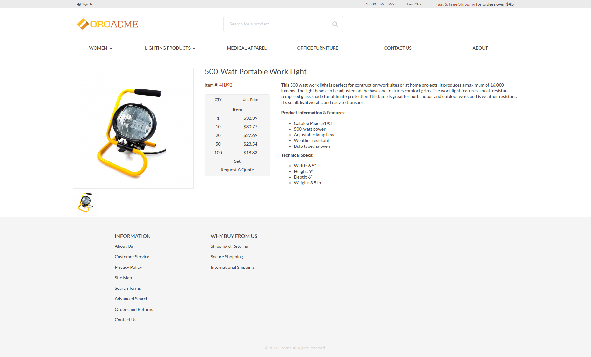
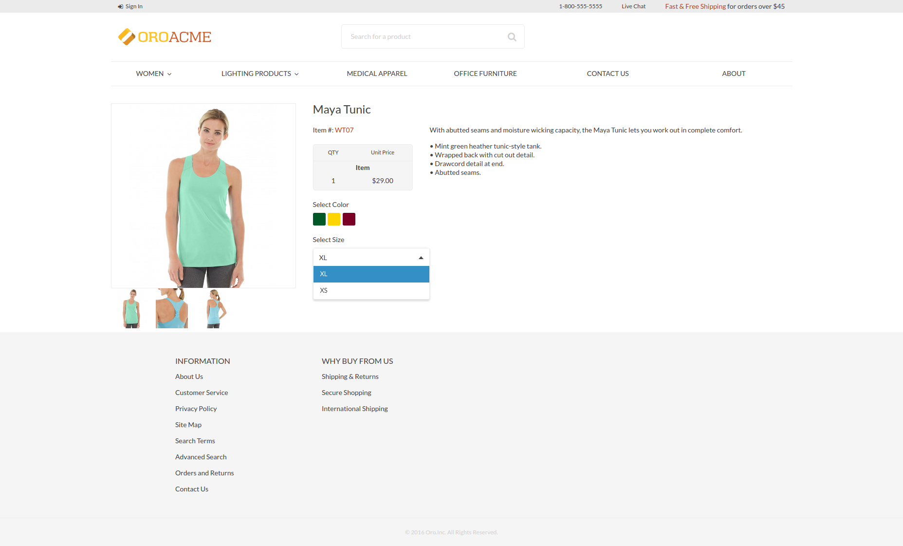
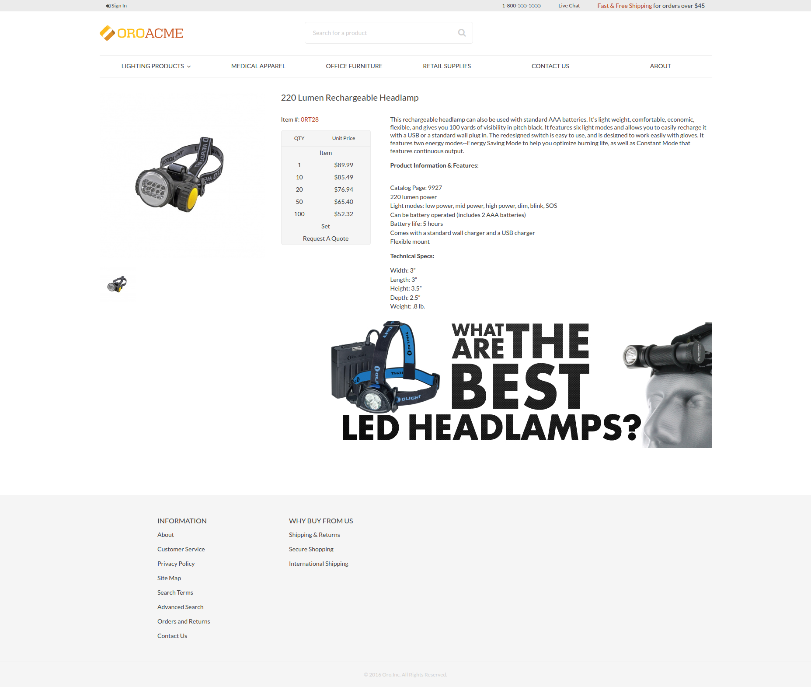
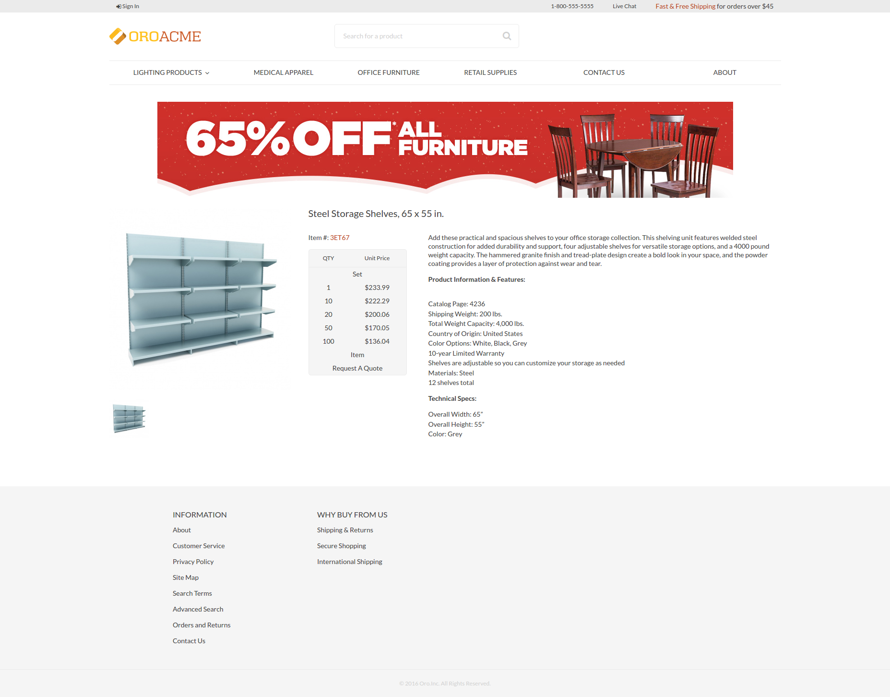
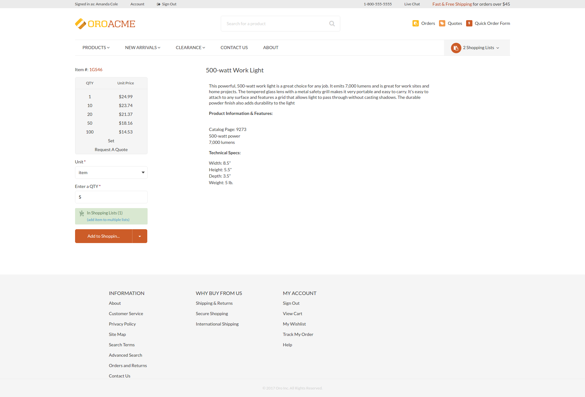
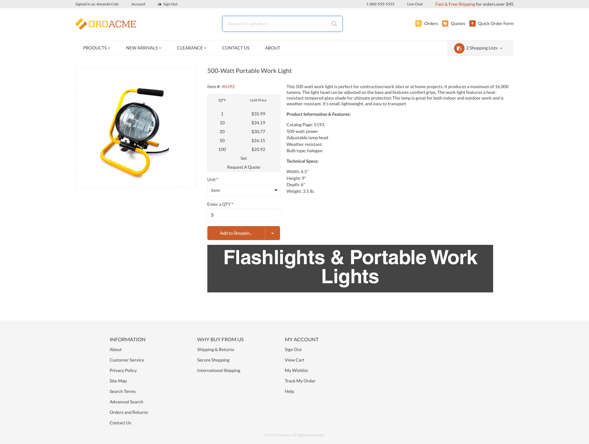

Customize Product View Page
=============================

In this example we consider how to customize product with different product types:

- [Simple Product](#simple-product)
- [Configurable Product](#configurable-product)
- [Change Product Page by Category](#change-product-page-by-category)
- [Product Page Templates](#product-page-templates)

### Getting started

Every product view page contains current **product_type** in layout context.
So you can use it in the your layout update **conditions**. When you customize any page don't forget to use **Symfony Profiler** and look into **Layout** section.
You can find there current layout **context** data and actual layout **tree**. Please see [Debug Information](https://github.com/orocrm/platform/tree/master/src/Oro/Bundle/LayoutBundle/Resources/doc/debug_information.md) for more details.

First of all we need to create **import** that will be used in **Simple Product** and **Configurable Product**.

```yml
# src/Acme/Bundle/ProductBundle/Resources/views/layouts/default/imports/oro_product_view/layout.yml

layout:
    actions:
        - '@setBlockTheme':
            themes: 'layout.html.twig'

        - '@addTree':
            items:
                product_view_page:
                    blockType: container
                product_container:
                    blockType: product_view_container
                    options:
                        product: '=data["product"]'
                product_title_mobile:
                    blockType: text
                    options:
                        text: '=data["locale"].getLocalizedValue(data["product"].getNames())'
                product_image:
                    blockType: product_image
                    options:
                        product: '=data["product"]'
                product_description_container:
                    blockType: container
                product_title_container:
                    blockType: container
                product_specification_container:
                    blockType: container
                product_specification:
                    blockType: container
                product_specification_sku:
                    blockType: text
                    options:
                        text: '=data["product"].getSku()'
                product_description_content:
                    blockType: container
                product_description:
                    blockType: text
                    options:
                        text: '=data["locale"].getLocalizedValue(data["product"].getDescriptions())'
                        escape: false
            tree:
                page_content:
                    product_view_page:
                        product_container:
                            product_image: ~
                            product_description_container:
                                product_title_container: ~
                                product_specification_container:
                                    product_specification:
                                        product_specification_sku: ~
                                product_description_content:
                                    product_description: ~

        - '@setOption':
            id: title
            optionName: params
            optionValue:
                '%name%': '=data["locale"].getLocalizedValue(data["product"].getNames())'

        - '@setOption':
            id: page_title
            optionName: defaultValue
            optionValue: '=data["locale"].getLocalizedValue(data["product"].getNames())'

        - '@move':
            id: page_title
            parentId: product_title_container
```

and template:

```twig
{# src/Acme/Bundle/ProductBundle/Resources/views/layouts/default/imports/oro_product_view/layout.html.twig #}


    

    <div {{ block('block_attributes') }}>
        {{ block_widget(block) }}
    </div>



    <h3 class="product-title">{{ text }}</h3>



    

    <div class="product-gallery-widget product-gallery-widget_vertical product-gallery-widget_l_floated">
        <div class="product-gallery product-gallery_vertical">
            <div class="product-gallery__image-holder">
                <div class="product-gallery__image-holder__carousel" data-product-gallery>
                    <div class="product-gallery__image-holder__container">
                        
                        
                    </div>
                    
                        
                    
                </div>
            </div>
        </div>
    </div>



    <div class="product__description-container">
        {{ block_widget(block) }}
    </div>



    

    <div {{ block('block_attributes') }}>
        {{ block_widget(block) }}
    </div>



    <div class="product__specification-container product__specification-container_l_floated">
        {{ block_widget(block) }}
    </div>



    <div class="product__specification">
        {{ block_widget(block) }}
    </div>



    <div>
        {{ 'oro.product.frontend.index.item'|trans }} <span class="red">{{ block_widget(block) }}</span>
    </div>



    <div class="product__description-content product__description-content_l_floated">
        <div class="product__description">
            {{ block_widget(block) }}
        </div>
    </div>

```

### Simple product

In our case simple product inherit all import properties. Create layout update that include **oro_product_view** import and has **conditions** to check if the current product has **simple** product type.
Our simple product looks like this:



```yml
# src/Acme/Bundle/ProductBundle/Resources/views/layouts/default/oro_product_frontend_product_view/simple_product.yml

layout:
    imports:
        - oro_product_view

    actions: []

    conditions: 'context["product_type"] == "simple"'
```

### Configurable product

Create layout update that include **oro_product_view** import and has **conditions** to check if the current product has **configurable** product type.
Add **product variants** block.
Our configurable product looks like this:


```yml
# src/Acme/Bundle/ProductBundle/Resources/views/layouts/default/oro_product_frontend_product_view/configurable_product.yml

layout:
    imports:
        - oro_product_view

    actions:
        - '@setBlockTheme':
            themes: 'configurable_product.html.twig'

        - '@add':
            id: product_variants
            blockType: product_variants
            parentId: product_specification_container
            siblingId: product_specification
            options:
                variants: '=data["product_variants"].getVariants(data["product"])'

    conditions: 'context["product_type"] == "configurable"'
```

template:

```twig
{# src/Acme/Bundle/ProductBundle/Resources/views/layouts/default/oro_product_frontend_product_view/configurable_product.html.twig #}


    
        
        <div class="product__{{ key }}s">
            <label for="product_variants_{{ key }}">Select {{ variant.name }}</label>

            
                
                    <span class="badge badge_sm product__colors__item color-item_{{ key }}">
                        <input type="checkbox" name="{{ key }}" alt="{{ name }}" />
                    </span>
                
            
                <select id="product_variants_{{ key }}" class="select select--size-s">
                    
                        <option value="{{ key }}">{{ name }}</option>
                    
                </select>
            
        </div>
    

```

#### Block types

For this example we need to create **product_variants** block type that used in **configurable product** layout update.

```yml
# src/Acme/Bundle/ProductBundle/Resources/config/block_types.yml

services:
...
    acme_product.layout.type.product_variants:
        parent: oro_layout.block_type.abstract_configurable_container
        calls:
            - [setOptionsConfig, [{variants: {required: true}}]]
            - [setName, ['product_variants']]
        tags:
             - { name: layout.block_type, alias: product_variants }
...
```

#### Data providers

Also we need to create **product_variants** data provider that used in **configurable product** layout update.

```yml
# src/Acme/Bundle/ProductBundle/Resources/config/services.yml

services:
...
    acme_product.layout.data_provider.product_variants:
        class: 'Acme\Bundle\ProductBundle\Layout\DataProvider\ProductVariantsProvider'
        tags:
            - { name: layout.data_provider, alias: product_variants }
...
```

example of data provider:

```php
<?php
// src/Acme/Bundle/ProductBundle/Layout/DataProvider/ProductVariantsProvider.php

namespace Acme\Bundle\ProductBundle\Layout\DataProvider;

use Symfony\Component\PropertyAccess\PropertyAccess;

use Oro\Bundle\EntityExtendBundle\Entity\AbstractEnumValue;
use Oro\Bundle\ProductBundle\Entity\Product;

class ProductVariantsProvider
{
    /**
     * @param Product $product
     *
     * @return array
     */
    public function getVariants(Product $product)
    {
        $variants = [];
        $variantFields = $product->getVariantFields();
        foreach ($variantFields as $variantField) {
            $variants[strtolower($variantField)]['name'] = $variantField;
        }

        $propertyAccessor = PropertyAccess::createPropertyAccessor();

        $variantLinks = $product->getVariantLinks();
        foreach ($variantLinks as $variantLink) {
            $childProduct = $variantLink->getProduct();
            foreach ($variants as $key => $variant) {
                /** @var AbstractEnumValue $enumValue */
                $enumValue = $propertyAccessor->getValue($childProduct, $key);
                $variants[$key]['elements'][$enumValue->getId()] = $enumValue->getName();
            }
        }

        return $variants;
    }
}
```

### Change Product Page by Category

Every product view page contains current **category_id** and **category_ids** in layout context.
So you can use it in the your layout update **conditions**. When you customize any page don't forget to use **Symfony Profiler** and look into **Layout** section.
You can find there current layout **context** data and actual layout **tree**. Please see [Debug Information](https://github.com/orocrm/platform/tree/master/src/Oro/Bundle/LayoutBundle/Resources/doc/debug_information.md) for more details.

#### Example 1 (by category ID)

We have a "Headlamps" category and we want to add some static html to all products in this category.
The condition is: **conditions: 'context["category_id"] == 4'**.

and the result is:


```yml
# src/Acme/Bundle/ProductBundle/Resources/views/layouts/default/oro_product_frontend_product_view/headlamps.yml

layout:
    actions:
        - '@setBlockTheme':
            themes: 'headlamps.html.twig'

        - '@add':
            id: product_sale_banner
            blockType: block
            parentId: product_view_main_container
            siblingId: ~
            prepend: false

    conditions: 'context["category_id"] == 4'
```

template:

```twig
{# src/Acme/Bundle/ProductBundle/Resources/views/layouts/default/oro_product_frontend_product_view/headlamps.html.twig #}


    <div class="text-right">
            
        </div>
        <br />

```

#### Example 2 (by parent category ID)

Imagine that we want to add sale banner to all product in first level category and their children. For example we have category "Furniture" with **id = 6**.
The condition is: **conditions: '6 in context["category_ids"]'**.

and the result is:


```yml
# src/Acme/Bundle/ProductBundle/Resources/views/layouts/default/oro_product_frontend_product_view/furniture.yml

layout:
    actions:
        - '@setBlockTheme':
            themes: 'furniture.html.twig'

        - '@add':
            id: product_sale_banner
            blockType: block
            parentId: page_content
            siblingId: ~
            prepend: true

    conditions: '6 in context["category_ids"]'
```

template:

```twig
{# src/Acme/Bundle/ProductBundle/Resources/views/layouts/default/oro_product_frontend_product_view/furniture.html.twig #}


    <div class="text-center">
        
    </div>
    <br />

```

### Product Family

#### Attribute Set (example 1)

@TODO

#### Attribute Set (example 2)

@TODO

#### Attribute Groups

@TODO

### Product Page Templates

Please see [Page Templates](https://github.com/orocrm/platform/tree/master/src/Oro/Bundle/LayoutBundle/Resources/doc/config_definition.md#page-templates) for more details.

You can modify visual presentation of product view page for every product or choose some page template for all by default.
First of all we need to create **config** for **page_templates** in our **theme**.

```yml
# src/Acme/Bundle/ProductBundle/Resources/views/layouts/default/config/page_templates.yml

templates:
    -
        label: Custom page template
        description: Custom page template description
        route_name: oro_product_frontend_product_view
        key: custom
    -
        label: Parent Additional page template
        description: Additional page template description
        route_name: oro_product_frontend_product_view
        key: additional
titles:
    oro_product_frontend_product_view: Product Page
```

Next lets add some **layout updates**:

```yml
# src/Acme/Bundle/ProductBundle/Resources/views/layouts/default/oro_product_frontend_product_view/page_template/custom/layout.yml

layout:
    actions:
        - '@remove':
            id: product_view_attribute_group_images
        - '@move':
            id: product_view_specification_container
            parentId: product_view_aside_container

```

```yml
# src/Acme/Bundle/ProductBundle/Resources/views/layouts/default/oro_product_frontend_product_view/page_template/additional/layout.yml

layout:
    actions:
        - '@setBlockTheme':
            themes: 'layout.html.twig'
        - '@add':
            id: product_view_banner
            blockType: block
            parentId: product_view_content_container

```

and **templates**:

```twig
{# src/Acme/Bundle/ProductBundle/Resources/views/layouts/default/oro_product_frontend_product_view/page_template/additional/layout.html.twig #}


    <div class="text-center">
        
    </div>
    <br />


```

#### Global level

To apply **custom page template** to all products, go to **System > Configuration > Commerce > Design > Theme**.
In section **Page Templates** choose **Custom page template** in **Product Page** select. Result  of product view page:


#### Entity level

To apply **custom page template** to selected products, go to **Products > Products** find your product and click **edit**.
In section **Design** choose **Additional page template** in **Page Template** select. Result of product view page:

