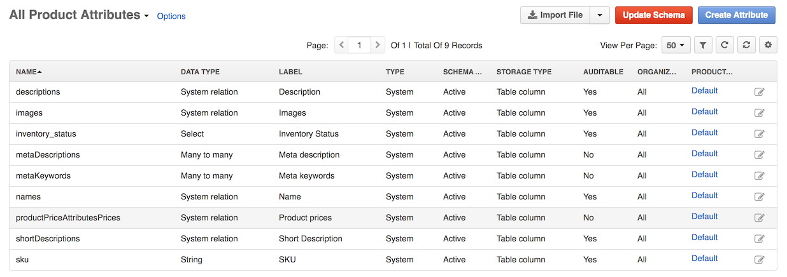
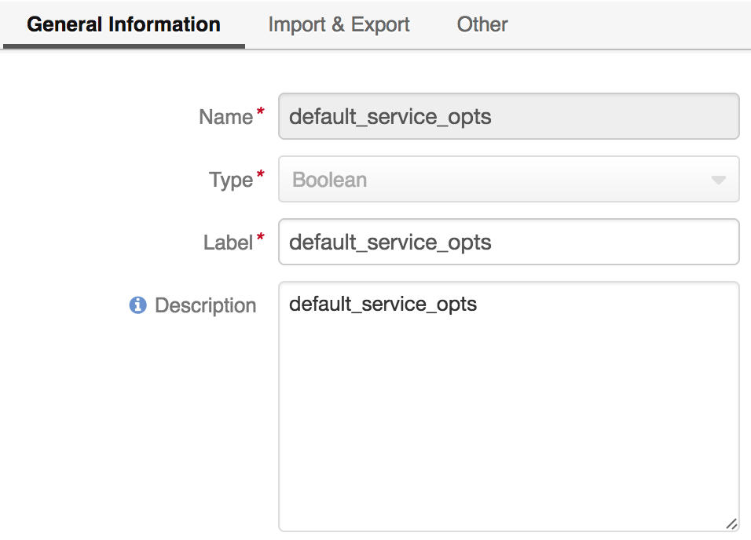
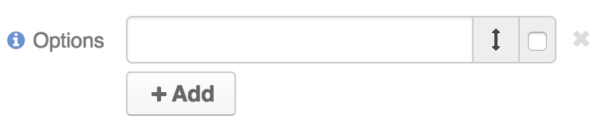
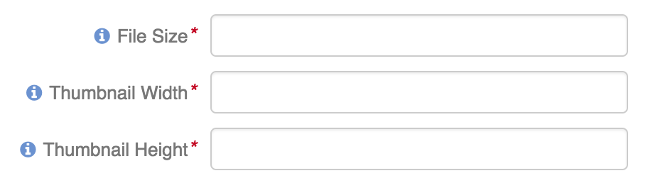
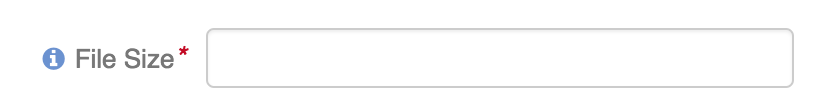
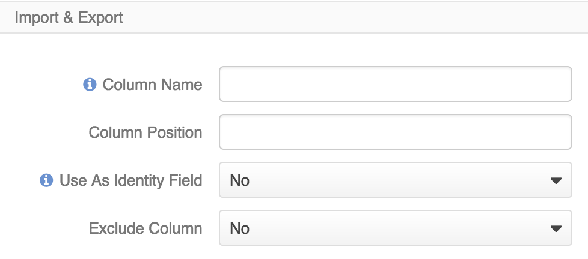
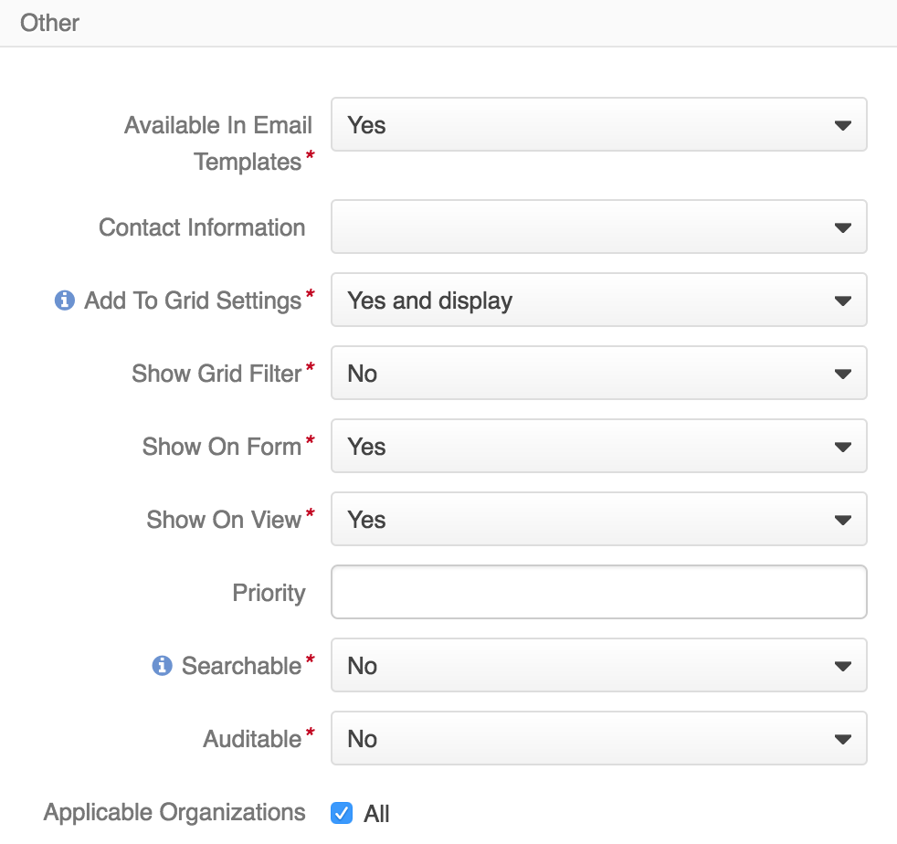
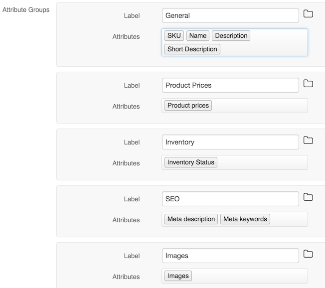
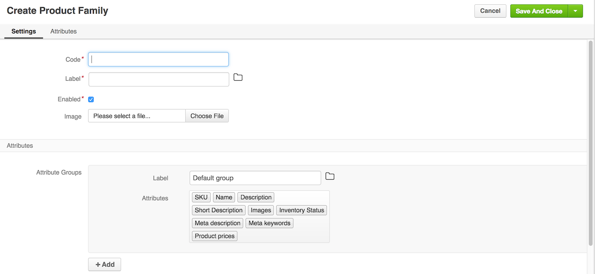
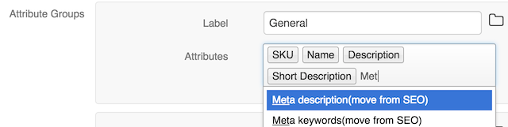

Product attributes
==================
This topic contains the following sections: 
* [Understanding Product Attributes](#understanding-product-attributes) 
* [Creating Product Attributes](#creating-product-attributes)
* [Understanding Product Families](#understanding-product-families)
* [Using Product Attributes in Product Families](#using-product-attributes-in-product-families)
* 

Understanding Product Attributes
--------------------------------

Product attribute in Product bundle is a special type of custom entity field that enables easy management for groups of attributes that are unique to a special product family. To limit the product data to the necessary characteristics, you can bind the attribute groups to the product families they fit.

For example, when your OroCommerce store sells TVs and T-shirts, these items share some generic attributes (e.g. name, vendor), and differ in the remaining attributes set. For example, there might be a *Screen properties* group that contains *resolution*, *diagonal*, and *matrix* that should be linked to the products in the TV product family. For the T-shirts family, the linked attribute group may have color, size, material, fit and care guidance (washing, ironing, dry cleaning, etc).

With product attributes functionality that extends the Product bundle, you can:
* add product attributes (extend fields)
* use product attributes in the scope of Product families (similar to categories) and attribute groups.
* organize and distinguish products of different types, which actually have different sets of characteristics applicable to. 

On the Product Attributes page, there is a grid of attributes created for the product entity. By defaults, there are only generic predefined attributes (sku, description, names).

**Note**: System attributes (sku, description, names) are shared among all product families. Delete is disabled.

Creating Product Attributes
---------------------------

To create a new Product Attribute:

1. Navigate to **Products > Product Attributes** using the main menu.

   
2. Click **Create attribute**. The following page opens:

   
3. Fill in the field name using only alphabetic symbols, underscore and numbers. It should be between 2 and 22 characters long.
4. Select an attribute type (bigint, select, string, etc) and click **Continue**. 
   The page with more product attribute details opens.
5. Fill in remaining general information:
   - Attribute label
   - Attribute description
     
     
   - Additional information for the product attributes of the following types:
      - **Select**, **Multi-Select**:
         - Click **+ Add** next to the *Options*.
         
           
         - Type in the option label. Tick the box next to the default option.
        
           
        - Repeat for more options.
        
          
      
      - **Image**: Enter maximum allowed file size and provide the thumbnail dimensions.
      
        
       
      - **File**: Enter maximum allowed file size.
      
        
6. Fill in details for the product attribute import/export:
   - Column Name
   - Column position
   - Use As Identity Field (options: **No**, Only when not empty, Always)
   - Exclude Column (options: **No**, Yes)
   
   
7. In the Other section, specify the configuration options for the product attribute view, search and use in other areas in OroCommerce:
   - Available In Email Templates (options: **Yes**, No)
   - Contact Information 
   - Add To Grid Settings (**Yes and display**, )
   - Show Grid Filter (**No**)
   - Show On Form (**Yes**,)
   - Show On View (**Yes**,)
   - Priority 
   - Searchable (**No**,) - includes the attribute into the search options on the backend.
   - Auditable (**No**, )
   - Applicable Organizations (All) 
   - Searchable (**No**, Yes) - includes the attribute into the search options on the OroCommerce web store.
   - Filterable (**No**, Yes)
   - Sortable (**No**, Yes)
   - Enabled (**No**, Yes)
   
   
8. Once all options and information are provided, click **Save**.
9. If the created attribute is of a *table column* storage type, click **Update Schema** to reindex the data for search and filter. 
   The product attribute storage type is set to *table column* for the attribute with Select of Multi-Select data type, and also for attribute of any type with *Filterable* or *Sortable* option enabled.
   If this step is ommited, the newly created attribute will not appear in the select attribute options in other areas of OroCommerce (e.g. product families configuration).
 
Understanding Product Families
------------------------------

The product family is designed to group product attributes for products of similar type (e.g TV attributes vs T-shirts attributes). By default, there is only one predefined product family with a set of default groups with nested system attributes with the following structure:

* General:
   - SKU
   - Name
   - Description
   - Short Description
* Images	
   - Images
* Inventory	
   - Inventory Status
* Product Prices
   - Product prices
* SEO
   - Meta keywords
   - Meta description
   

Creating new Product Family
---------------------------
Default Product Family may not be enough to cover all your needs. To create a new product family:

1. Navigate to **Products > Product Families** using the main menu.
2. Click **Create Product Family**.

   
3. Provide the product family details:
   - Code
   - Label
   - Enabled
   - Image
4. In the Attributes section, link the attributes to the product family and organize them into groups as described in the sections below. **Note**: Ensure that every system attribute is linked to the proper attribute group in the product family. By default, they are linked to the default_group, but you may modify the link as necessary.
5. Once you are happy with the product attribute organization, click **Save**.

Using Product Attributes in Product Families
--------------------------------------------

### Adding a new Product Attribute Group

1. Navigate to **Products > Product Families** using the main menu.
2. Click **+ Add** to create a new group. Type in the label and add the product attributes:
   - Start typing the product attribute name. Filtered list will apear as you type. 
   - Select the attribute from the list or press **Enter** once there is only one option.
3. Once you are done with the product attribute organization, click **Save**.

### Adding a Product Attribute to the Attribute Group

1. Navigate to **Products > Product Families** using the main menu.
2. Start typing the product attribute name. Filtered list will apear as you type. Select the attribute from the list or press Enter once there is only one option.
3. Once you are done with the product attribute organization, click **Save**.

### Moving a Product Attribute to Another Attribute Group

1. Navigate to **Products > Product Families** using the main menu.
2. When an attribute you are adding to the group is already a member of another attribute group in this product family, the *(move from \<attribute group\>* will be shown next to the attribute name in the hint list that appears as you type.
   
   
   
   Adding such attribute to another group will remove it from it's current group.
3. Once you are done with the product attribute organization, click **Save**.

### Deleting a Product Attribute from the Attribute Group

1. Navigate to **Products > Product Families** using the main menu.
2. Click the **X** next to the attribute name to remove it from the attribute group. Though it is impossible to delete system attributes, you can move them to the default attribute group. This will remove an attribute from it's current group.
3. Once you are done with the product attribute organization, click **Save**.

### Deleting a Product Attribute Group

To remove existing aproduct attribute group:
1. Navigate to **Products > Product Families** using the main menu.
2. Click **x** on the top right of the group area. If the group contains any system attributes, the confirmation dialog appears. Once confirmed, the group is deleted and the system attributes are automatically moved to deafult group.
3. Once you are done with the product attribute organization, click **Save**.

Binding a Product to a Product Family
-------------------------------------
Every product may be bound to one product family. The default one contains generic product attributes (e.g. SKU, name, description, metadata, etc.) Custom product family contains the generic product attributes and any number of custom attributes organized in groups.

When creating a new product, after you select a custom product family and click **Continue**, the default and custom product attributes are shown as tabbed groups between the standard *General* product details and before the *Inventory* details. Depending on attribute type each attribute has corresponding input (date picker, file, text area, select).

Customizing Product Attributes Layout on the OroCommerce Website
----------------------------------------------------------------

For information on how to customize the way attribute groups display on OroCommerce Web Store, see [Customize products using layouts](./Resources/doc/customize-products.md). For quick examples, please, check out the following sections:
* [Product Family](./customize-pdp.md#product-family)
  - [Attribute Set (example 1)](./customize-pdp.md#attribute-set-example-1)
  - [Attribute Set (example 2)](./customize-pdp.md#attribute-set-example-2)
        - [Attribute Groups](./customize-pdp.md#attribute-groups)
