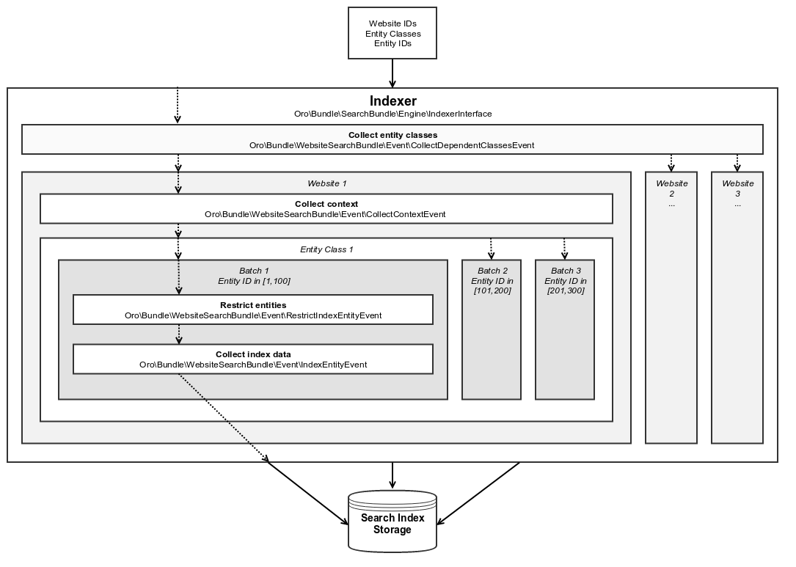

Indexation process
==================


### How to trigger reindexation

#### From the code

The website search index is mostly event based. The reindexation is triggered using the
`oro_website_search.reindexation_request` event and is processed by the `Oro\Bundle\WebsiteSearchBundle\Event\ReindexationRequestEvent` class.

This class contains the following parameters that specify the scope of the entities that have to be reindexed:

* **$websitesIds** - list of website identifiers that should take part in the reindexation. When no IDs are provided, reindex affects all websites.
* **$classesNames** - list of entity class names that have to be reindexed. When no classes are provided, 
all entities from the search index are reindexed;
* **$ids** - list of entity identifiers that has to be reindexed. When no IDs are provided, all entities of the
specified classes are reindexed;
* **$scheduled** (default `true`) - boolean flag that defines whether reindexation has to be scheduled (asynchronous)
or immediate (synchronous).

For example:
* `$websitesIds = [], $classesNames = ['Oro\Bundle\ProductBundle\Entity\Product'], $ids = [1,2,3], $scheduled = false`
This combination of parameter values requests immediate reindex of the products with IDs 1, 2 and 3 for all
websites (e.g. when the prices for products with IDs 1, 2, and 3 were updated).
* `$websitesIds = [2], $classesNames = [], $ids = [], $scheduled = true` - whole search index scope (all entities)
These values call for scheduled (asynchronous) reindex of the website with ID=2, for example, after this website was created.

Sample reindexation triggered from the code:

```php
use Symfony\Component\EventDispatcher\EventDispatcherInterface;
use Oro\Bundle\WebsiteSearchBundle\Event\ReindexationRequestEvent;

/** @var EventDispatcherInterface $eventDispatcher */
$eventDispatcher = $this->container->get('event_dispatcher');

// reindexation scope - $websitesIds = [2], $classesNames = [], $ids = [], $scheduled = true
$event = new ReindexationRequestEvent([], [2]);
$eventDispatcher->dispatch(ReindexationRequestEvent::EVENT_NAME, $reindexationEvent);
```
#### From the CLI

Alternatively, you may trigger reindexation from the CLI using the `oro:website-search:reindex` command with the following
optional parameters:

* **website-id** (optional) - identifier of the website this reindex is applicable to;
* **class** (optional) - names of the entities that have to be reindexed.

Below is an example of the reindex triggered via CLI:

```
> php app/console oro:website-search:reindex --website-id=2
Starting reindex task for all mapped entities and website ID 2...
Reindex finished successfully.
```


### Search indexer

Search indexer class is responsible for putting the entity information into the search index and should implement the
`Oro\Bundle\SearchBundle\Engine\IndexerInterface` interface. Default synchronous indexer is accessible via the 
`oro_website_search.indexer` service.



For indexation, indexer performs the following steps:

1. Defines the list of allowed websites and collects the list of entities that has to be indexed.
2. Collects current context for every website found at the first step.
3. Starts the indexation process for every affected entity in a scope of the specific website.
4. Splits indexation of the specific entity into batches by entity identifiers, collects index data and saves them in search index storage.


### Search indexer events

The following sections describe events that are triggered during the indexation of data for website search:

#### Collect dependent entity classes

_Name:_ `oro_website_search.event.collect_dependent_classes`

_Class:_ `Oro\Bundle\WebsiteSearchBundle\Event\CollectDependentClassesEvent`

The event collects the list of all entity classes which have to take part in the indexation. Apart from the main entity class, the list may include other entities, e.g. indexation of customers might require
indexation of orders.

#### Collect context

_Name:_ `oro_website_search.event.collect_context`

_Class:_ `Oro\Bundle\WebsiteSearchBundle\Event\CollectContextEvent`

The event is used to collect data that has to be consistent during the indexation. For example, the environment-related
variables may change value during the indexation, but the indexation process must rely on the values that were actual when indexation started. This event is triggered for every affected website, so the environment-related variables (e.g system configuration values defined for a website) should be defined in the website scope. All the necessary data should be added to the indexation context.

#### Restrict entities

_Name:_ `oro_website_search.event.restrict_index_entity`

_Class:_ `Oro\Bundle\WebsiteSearchBundle\Event\RestrictIndexEntityEvent`

This event is used to restrict the list of entities that has to be stored in the search index. For example, a search should work only with the products that are enabled and are in stock. To restrict entities, add required conditions to the ORM query builder. Later it is used to retrieve entities that have to be indexed.

#### Collect index data

_Name:_ `oro_website_search.event.index_entity`

_Class:_ `Oro\Bundle\WebsiteSearchBundle\Event\IndexEntityEvent`

This is the most important event because it collects the data that should be persisted to the search index. This event contains a batch of entities that have to be indexed, and you (being a developer) extract the information for the index from entities or other sources, and feed it to the event and put to the search index on the later stage. To make data collection faster and more efficient, the entities are passed in batches (default batch size is 100 entities). In most cases, you can get all the required information using just one request instead of triggering a separate request for every entity. The event also supports work with placeholders, so you can get all the related information and put it into the search index according to the specified placeholders.


### Asynchronous search indexer

The website search supports two types of indexation: immediate (synchronous) and scheduled (asynchronous). Regular indexer works synchronously, so you have to wait until indexation is finished. Asynchronous indexer sends a message
to the Message Queue to process it later by workers. 

Default asynchronous indexer is implemented in the 
`Oro\Bundle\WebsiteSearchBundle\Engine\AsyncIndexer` class and is accessible via the `oro_website_search.async.indexer` service. To trigger asynchronous indexation, set **$scheduled** parameter to `true`.
Asynchronous indexer is using `Oro\Bundle\WebsiteSearchBundle\Engine\AsyncMessaging\ReindexMessageGranularizer` to split message per entity and websiteId. What the request message granularizer does: 

* on 1 indexation request message to handle entity `Product` within all websites `[1, 2, 3, 4, 5]` it splits the message into 5 different smaller messages, that allows handling each `Product` entity with each websiteId separately
* on messages that contain large amounts of entityIds, it splits entityIds table into smaller chunks, for example 1000 entityIds will be split into 10 messages with 100 entityIds each  

For each message `Oro\Bundle\WebsiteSearchBundle\Engine\AsyncMessaging\SearchMessageProcessor` builds jobs with unique names to avoid parallel reindexation of same sets of entities, and runs them **unique** performing actual reindexation. In case, no parameters have been passed (empty class and context), the job will **NOT** be run as unique.

Asynchronous indexer can send messages with the following topics:

* `oro.website.search.indexer.save` - save list of specified entities to the search index;
* `oro.website.search.indexer.delete` - delete list of specified entities from the search index;
* `oro.website.search.indexer.reset_index` - reset (clear) the entire index or a specific entity class in it;
* `oro.website.search.indexer.reindex` - reindex the entire index or a specific part of it.


### Example

Let's assume that you have the following index structure and want to index the product data:

```yaml
Oro\Bundle\ProductBundle\Entity\Product:
    alias: oro_product_WEBSITE_ID
    fields:
        -
            name: sku
            type: text
        -
            name: name_LOCALIZATION_ID
            type: text
        -
            name: all_text_LOCALIZATION_ID
            type: text
        -
            name: all_text
            type: text
```

Below is an example of the index listener for the index structure above:

```php
use Oro\Bundle\ProductBundle\Entity\Product;
use Oro\Bundle\WebsiteBundle\Provider\AbstractWebsiteLocalizationProvider;
use Oro\Bundle\WebsiteBundle\Provider\WebsiteLocalizationProvider;
use Oro\Bundle\WebsiteSearchBundle\Event\IndexEntityEvent;
use Oro\Bundle\WebsiteSearchBundle\Manager\WebsiteContextManager;

class WebsiteSearchProductIndexerListener
{
    /**
     * @var WebsiteContextManager
     */
    private $websiteContextManger;

    /**
     * @var WebsiteLocalizationProvider
     */
    private $websiteLocalizationProvider;

    /**
     * @param AbstractWebsiteLocalizationProvider $websiteLocalizationProvider
     * @param WebsiteContextManager $websiteContextManager
     */
    public function __construct(
        AbstractWebsiteLocalizationProvider $websiteLocalizationProvider,
        WebsiteContextManager $websiteContextManager
    ) {
        $this->websiteLocalizationProvider = $websiteLocalizationProvider;
        $this->websiteContextManger = $websiteContextManager;
    }

    /**
     * @param IndexEntityEvent $event
     */
    public function onWebsiteSearchIndex(IndexEntityEvent $event)
    {
        // get current website ID
        $websiteId = $this->websiteContextManger->getWebsiteId($event->getContext());
        if (!$websiteId) {
            $event->stopPropagation();
            return;
        }

        // get all entities that have to be indexed
        /** @var Product[] $products */
        $products = $event->getEntities();

        // get all localizations of the current website
        $localizations = $this->websiteLocalizationProvider->getLocalizationsByWebsiteId($websiteId);

        // iterate over entities that have to be indexed
        foreach ($products as $product) {
            // add non localized field to search index
            $event->addField($product->getId(), 'sku', $product->getSku(), true);

            // add localized field to search index
            foreach ($localizations as $localization) {
                $event->addPlaceholderField(
                    $product->getId(),
                    'name_LOCALIZATION_ID',
                    (string)$product->getName($localization),
                    ['LOCALIZATION_ID' => $localization->getId()],
                    true
                );
            }
        }
    }
}
```

Service declaration for such listener might look like the following example:

```yaml
services:
    oro_product.event_listener.website_search_index:
        class: 'Oro\Bundle\ProductBundle\EventListener\WebsiteSearchProductIndexerListener'
        arguments:
            - '@oro_website.provider.website_localization'
            - '@oro_website_search.manager.website_context_manager'
        tags:
            - { name: kernel.event_listener, event: oro_website_search.event.index_entity.product, method: onWebsiteSearchIndex }
```

This listener has two dependencies: a `AbstractWebsiteLocalizationProvider` (usually represented by the
`oro_website.provider.website_localization` service) and a `WebsiteContextManager` (usually represented by the 
`oro_website_search.manager.website_context_manager` service). The listener uses the 
`oro_website_search.event.index_entity.product` event name, and the `product` suffix means that this listener is called only for the product indexation. To call a method for all entities, use the event without suffix
(`oro_website_search.event.index_entity`).

First, indexation method extracts website ID from the context. If the website is not found (e.g. it was removed or became not accessible), indexation stops. Otherwise, the method gets the list of products from the event and the list of localizations for the current website. Finally, the required data is extracted from entities and is added to the event.

To add plain data without a placeholder, handle the event by calling the `addField` method. Pass the following information: identifier of the entity (required), field name (required), field value (required) and whether this value should appear in `all_text` fields (optional, default `false`).

To add data with a placeholder, handle the by calling the `addPlaceholderField` method for every data combination that
has to be stored in a search index. The method accepts identifier of the entity (required), field name (required),
field value (required), the list of placeholders with their values (required ) and a flag that states whether this value should appear in `all_text` fields (optional, default `false`).

Let's assume that Oro application has two websites and two localizations:

* Global website (`ID=1`) supports two localizations (English `ID=1` and Russian `ID=2`);
* Russian website (`ID=2`) supports one localization (Russian `ID=2`).

And here is what search index might contain after the indexation:

**oro_product_1**

```json
{
    1: {
        sku: "PR1",
        name_1: "First product",
        name_2: "Первый продукт",
        all_text_1: "PR1 First product",
        all_text_2: "PR1 Первый продукт",
        all_text: "PR1 First product Первый продукт"
    },
    2: {
        sku: "PR2",
        name_1: "Second product",
        name_2: "Второй продукт",
        all_text_1: "PR2 Second product",
        all_text_2: "PR2 Второй продукт",
        all_text: "PR2 Second product Второй продукт"
    }
}
```

**oro_product_2**

```json
{
    1: {
        sku: "PR1",
        name_2: "Первый продукт",
        all_text_2: "PR1 Первый продукт",
        all_text: "PR1 Первый продукт"
    },
    2: {
        sku: "PR2",
        name_2: "Второй продукт",
        all_text_2: "PR2 Второй продукт",
        all_text: "PR2 Второй продукт"
    }
}
```

Values in all `all_text` fields are generated automatically based on the values of all fields passed to search index.
