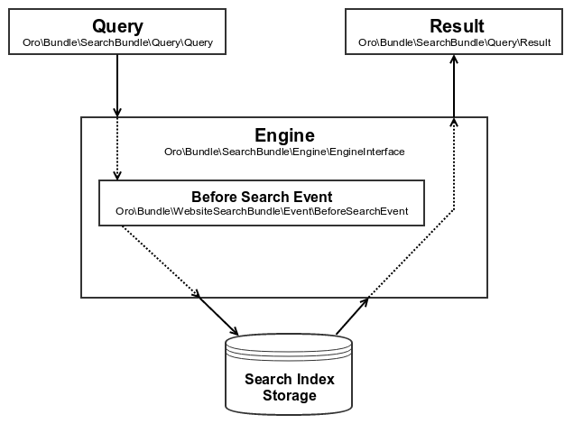

How to perform search
=====================


### Search engine

Search engine is an entry point in Oro application that is used to perform search request. Search engine implements
 `Oro\Bundle\SearchBundle\Engine\EngineInterface` interface with one method - `search(Query $query, array $context = [])`.
This method accepts a low level query object (`Oro\Bundle\SearchBundle\Query\Query`), sends a request to the
search engine and returns result object (`Oro\Bundle\SearchBundle\Query\Result`). The `$context` variable may be used to pass
additional parameters specific for the search engines. A default website search engine is accessible via the
`oro_website_search.engine` service.



Every engine may have its own requests to modify the way request is sent. However, every engine should support the `Oro\Bundle\WebsiteSearchBundle\Event\BeforeSearchEvent` out of the box. This event is
triggered before the engine queries the search index storage, so the developer can check request parameters and modify the query according to the business logics.

The event name - `oro_website_search.before_search` - can be used to add a new listener.

Here is an example of such listener definition:

```yaml
services:
    oro_product.product_visibility_restriction_listener:
        class: 'Oro\Bundle\ProductBundle\EventListener\ProductVisibilityRestrictionListener'
        arguments:
            - '@oro_product.product.manager'
            - '@oro_website_search.provider.search_mapping'
        tags:
            - { name: kernel.event_listener, event: oro_website_search.before_search, method: process }
```


### Search query

Developer may start constructing a search query by adjusting the `Oro\Bundle\SearchBundle\Query\Query` example.

Let's assume there is a product entity with the following index structure:

```yaml
Oro\Bundle\ProductBundle\Entity\Product:
    alias: oro_product
    fields:
        -
            name: sku
            type: text
        -
            name: name
            type: text
        -
            name: price
            type: decimal
        -
            name: all_text
            type: text
```

and you want the following query to be executed:

```
SELECT
    text.sku,
    text.name,
    decimal.price
FROM
    oro_product
WHERE
    text.all_text ~ product
ORDER_BY
    decimal.price ASC
```

The following example illustrates how to build and execute such a query:

```php
use Oro\Bundle\SearchBundle\Query\Query;
use Oro\Bundle\SearchBundle\Query\Result;
use Oro\Bundle\SearchBundle\Query\Criteria\Criteria;
use Oro\Bundle\SearchBundle\Engine\EngineInterface;

$query = new Query();
$query
    ->addSelect(['text.sku', 'text.name', 'decimal.price'])
    ->from('oro_product')
    ->getCriteria()
    ->andWhere(Criteria::expr()->contains('text.all_text', 'product'))
    ->orderBy(['decimal.price' => Query::ORDER_ASC]);

/** @var EngineInterface $engine */
$engine = $this->getContainer()->get('oro_website_search.engine');

/** @var Result $engine */
$result = $engine->search($query);
```

Where the `$result` variable is an `Oro\Bundle\SearchBundle\Query\Result` object that contains collection of
`Oro\Bundle\SearchBundle\Query\Result\Item` objects. Every object in the collection contains information about an entity involved in a search query: entity class, entity ID and additional selected data.

This type of query is used when the search engine and its configuration is unknown, and you need an instance of an engine which implements
`Oro\Bundle\SearchBundle\Engine\EngineInterface`.

As a universal, search-engine agnostic solution, you may use the `Oro\Bundle\WebsiteSearchBundle\Query\WebsiteSearchQuery` that implements the
`Oro\Bundle\SearchBundle\Query\SearchQueryInterface` interface. This type does not require additional search-engine-specific parameters and can be used in components that should be able to
work with any search engine. Basically, such query encapsulates previous type of query and the required parameters to
perform search (in this case it is a search engine).

To create the latter type of query, you can use specific factory for website search, or use the generic one and specify the index you used:

```php
$query = $this->container->get('oro_website_search.query_factory')->create();
// OR
$query = $this->container->get('oro_search.query_factory')->create(['search_index' => 'website']);
```

Let's execute the request to the search index mentioned above using second type of query:

```php
use Oro\Bundle\SearchBundle\Query\SearchQueryInterface;
use Oro\Bundle\SearchBundle\Query\Result;
use Oro\Bundle\SearchBundle\Query\Criteria\Criteria;

/** @var SearchQueryInterface $query */
$query = $this->container->get('oro_website_search.query_factory')->create();
$query
    ->addSelect(['text.sku', 'text.name', 'decimal.price'])
    ->setFrom('oro_product')
    ->addWhere(Criteria::expr()->contains('text.all_text', 'product'))
    ->setOrderBy('decimal.price', Query::ORDER_ASC);

/** @var Result $engine */
$result = $query->getResult();
```

As you can see, the interface is similar, but you are not aware about search engine and index type that is used. This information is resolved on the factory level, so you can override and decorate the service that represents the factory to customize search behaviour.


### Search repository

To store custom queries that are used to receive data from the search index, SearchBundle provides the search repository class -- 
`Oro\Bundle\SearchBundle\Query\SearchRepository` -- with default logic. The WebsiteSearchBundle extends this class and
adds `Oro\Bundle\WebsiteSearchBundle\Query\WebsiteSearchRepository`. The only difference between these repositories is
the type of index that is used. Basic repository uses default index from SearchBundle, and the website search repository uses website search index.

You may want to use website repository to create a specialized repository for an entity in the website search index. Similar to the Doctrine object repository, you can use this one to store the website search related methods.

Let's have a look at the example of such repository:

```php
namespace Oro\Bundle\ProductBundle\Search;

use Oro\Bundle\SearchBundle\Query\Criteria\Criteria;
use Oro\Bundle\SearchBundle\Query\Query;
use Oro\Bundle\SearchBundle\Query\Result;
use Oro\Bundle\SearchBundle\Query\SearchQueryInterface;
use Oro\Bundle\WebsiteSearchBundle\Query\WebsiteSearchRepository;

class ProductRepository extends WebsiteSearchRepository
{
    /**
     * @param string $string
     * @return Result
     */
    public function findByAllText($string)
    {
        /** @var SearchQueryInterface $query */
        $query = $this->createQuery();
        $query
            ->addSelect(['text.sku', 'text.name', 'decimal.price'])
            ->addWhere(Criteria::expr()->contains('text.all_text', $string))
            ->setOrderBy('decimal.price', Query::ORDER_ASC);

        return $query->getResult();
    }
}
```

This is exactly the same query described before encapsulated in the repository. No need to call the factory methods. Define this repository as a service and use it wherever you need it.

Below is an example of search repository service declaration:

```yaml
services:
    oro_product.website_search.repository.product:
        parent: oro_website_search.repository.abstract
        class: 'Oro\Bundle\ProductBundle\Search\ProductRepository'
        calls:
            - [setEntityName, ['%oro_product.entity.product.class%']]
```

Parent `oro_website_search.repository.abstract` service already contains all required constructor arguments. You may specify the entity name to automatically fill the `FROM` part of the query. This call is optional. If it is missing, an empty query will be created.
